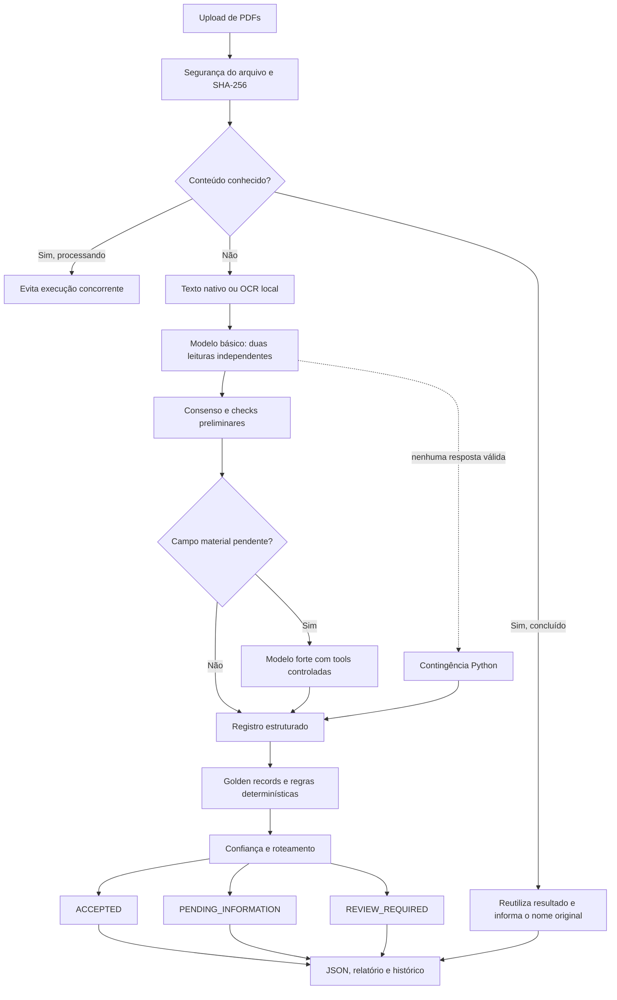
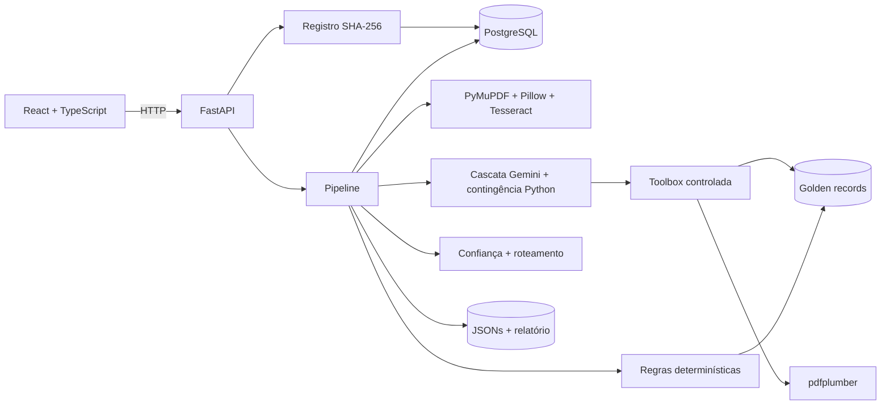

<p align="center">
  
</p>

<p align="center">
  <strong>Eventos corporativos transformados em dados confiáveis, explicáveis e prontos para operação.</strong>
</p>

<p align="center">
  
  
  
  
  
</p>

---

# FinTrace

O FinTrace é uma mesa de controle para processamento de avisos de eventos
corporativos. A plataforma recebe PDFs nativos ou escaneados, extrai os dados
financeiros, confere cada resultado com regras determinísticas e golden records
e entrega ao operador uma decisão acompanhada da evidência que a sustenta.

O produto foi desenhado para um cenário em que uma resposta plausível não é
suficiente. Cada campo informa o que foi encontrado, onde foi encontrado, como
foi lido, qual é sua confiança e quais controles foram aplicados.

> IA para interpretar. Código para validar. Evidência para confiar.

## Visão do produto

O fluxo da interface acompanha a rotina de um operador de Asset Servicing:

1. **Envie um ou vários PDFs.** A área de upload aceita lote, valida os arquivos
   e é limpa depois do processamento.
2. **Comece pelo que exige atenção.** O resumo separa documentos aceitos, em
   revisão, aguardando informação e com falha.
3. **Confira valor e evidência juntos.** Cada campo mostra origem, confiança,
   página, trecho do documento e regras relacionadas.
4. **Entenda a decisão.** O sistema explica por que um registro foi aceito ou
   encaminhado para atuação humana.
5. **Reavalie quando necessário.** Uma nova execução preserva o identificador e
   adiciona uma revisão ao histórico.

Documentos analisados permanecem disponíveis durante a sessão, mesmo depois de
novos uploads. Se o mesmo conteúdo for enviado com outro nome, o FinTrace
reutiliza o resultado sem chamar a IA novamente e informa tanto o nome enviado
agora quanto o nome da primeira versão salva.

### O que o produto entrega

| Capacidade | Resultado operacional |
|---|---|
| Extração estruturada | Emissor, CNPJ, ISIN, ticker, classe, tipo de evento, datas, valores, tributação, proporção e moeda |
| PDFs nativos e escaneados | Leitura nativa com OCR seletivo e melhoria local de imagem |
| Validação de identidade | Conferência com `golden_records.csv`, conflitos e enriquecimento rastreáveis |
| Validação financeira e temporal | Regras reproduzíveis para datas, valores bruto/líquido, imposto, moeda e proporções |
| Confiança explicável | Score por campo, concordância entre passagens e score consolidado do documento |
| Tratamento de incerteza | `ACCEPTED`, `PENDING_INFORMATION`, `REVIEW_REQUIRED` ou `FAILED` com motivos estruturados |
| Auditoria | Evidência por página, método de leitura, tentativas dos agentes e JSON para download |
| Controle de duplicidade | Identidade por SHA-256, reserva concorrente e reutilização de resultado |
| Histórico | Artefatos imutáveis em PostgreSQL/JSONB e saídas inspecionáveis no filesystem |

## Comece em poucos minutos

Pré-requisitos:

- Docker com Docker Compose;
- uma chave do Gemini para usar a extração por IA.

```bash
cp .env.example .env
```

Adicione a chave ao `.env`:

```dotenv
GEMINI_API_KEY=sua-chave
```

Inicie todos os serviços:

```bash
./e_scripts/start.sh
```

Depois, acesse:

- Produto: <http://localhost:5173>
- API interativa: <http://localhost:8000/docs>
- Saúde do ambiente: <http://localhost:8000/api/health>

Para encerrar:

```bash
./e_scripts/stop.sh
```

Os dados de entrada, as saídas e o volume do PostgreSQL são preservados. Para
remover os containers e a rede da aplicação, sem apagar esses dados:

```bash
./e_scripts/remove.sh
```

## Como o FinTrace decide



A LLM interpreta o documento, mas não possui autoridade final sobre o registro.
Identidade, coerência financeira, sequência de datas, confiança e roteamento são
recalculados pelo backend.

### Cascata de extração

Com uma chave configurada, o processamento segue esta ordem:

1. O modelo básico faz duas leituras independentes do texto normalizado.
2. O backend consolida as respostas e calcula concordância por campo.
3. Checks preliminares avaliam campos necessários, grounding da evidência,
   referência, datas, valores, classificação e qualidade do OCR.
4. O modelo forte só é chamado quando um campo material necessário ao evento
   continua ausente, ambíguo, conflitante ou ilegível.
5. O resultado passa pelas validações canônicas e pelo motor de confiança.

Uma inconsistência em campo não material permanece auditável, mas não provoca
escalonamento por si só. O objetivo do modelo forte é resolver lacunas de
extração, não substituir regras determinísticas nem revisar indiscriminadamente
uma resposta completa.

Se nenhum modelo produzir uma resposta estruturada válida, o extrator Python
atua como contingência operacional. Uma resposta válida porém incompleta não é
mascarada por esse fallback: a incerteza é preservada e pode seguir para revisão
humana. Sem chave do Gemini, a contingência Python é usada diretamente.

### Tools com acesso mínimo

Antes da extração estruturada, o modelo básico e o modelo forte passam por uma
etapa dedicada que força `lookup_golden_record` em modo function calling `ANY`.
O agente deve solicitar uma ou duas consultas com os identificadores disponíveis;
zero ou mais de duas chamadas invalidam a etapa. O backend executa a função e
injeta os resultados na etapa seguinte. Quando necessário, o modelo forte também
recebe três funções de leitura vinculadas somente ao PDF atual:

- `extract_pdf_text` — texto de um intervalo controlado de páginas;
- `extract_pdf_tables` — tabelas de uma página;
- `inspect_pdf_words` — palavras e coordenadas para relações de layout.

A consulta de referência é obrigatória; as tools de PDF devem ser usadas apenas
quando o texto normalizado não permitir a verificação. Cada passagem aceita no
máximo cinco chamadas remotas automáticas. O agente não recebe shell, caminho
arbitrário, filesystem genérico ou execução de código.

### Leitura de PDFs e OCR

O pré-processamento tenta primeiro o texto nativo com PyMuPDF. Páginas sem
conteúdo suficiente são renderizadas a 300 DPI e processadas localmente em duas
versões:

- tons de cinza, autocontraste, redução de ruído e nitidez;
- binarização com limiar de Otsu.

O Tesseract lê as duas versões, e a melhor saída forma o texto normalizado. Isso
reduz chamadas desnecessárias ao provider e mantém a melhoria de imagem sob
controle determinístico.

## Confiança que pode ser explicada

A confiança de campo varia de `0` a `100`. Para valores encontrados no
documento, o score combina 70% da qualidade objetiva e 30% da concordância entre
as respostas válidas dos agentes.

| Situação | Base de confiança |
|---|---:|
| Evidência em texto nativo | 92 |
| Evidência obtida por OCR | 78 |
| Valor confirmado pela referência | 95 |
| Derivação aprovada por todas as regras | 95 |
| Informação explicitamente não divulgada, com evidência | 95 |
| Campo ambíguo, conflitante ou ilegível | 10 |
| Regra relacionada reprovada | 15 |
| Campo desconhecido | 0 |

`agent_agreement` é exibido separadamente. Ele representa concordância entre
respostas válidas, não disponibilidade do provider e nem probabilidade
estatística de acerto.

O `document_confidence.score` é a média dos campos materiais do tipo de evento;
campos ausentes contribuem com zero. Um score inferior a 75, uma regra material
reprovada ou um campo crítico de baixa confiança exige revisão humana.

Um campo pode ter `value: null`, `status: NOT_DISCLOSED` e confiança alta. Isso
significa que existe evidência forte de que o emissor ainda não divulgou a
informação — um caso de acompanhamento, não de falha de extração.

### Regras financeiras com contexto

Os cálculos usam `Decimal` e tolerância explícita. Para JCP, por exemplo, o
sistema confere a relação entre valor bruto, alíquota e valor líquido.

Quando a tributação depende do beneficiário:

- um valor líquido explicitamente divulgado no documento é preservado com
  aviso de aplicabilidade e ainda passa pela conferência matemática;
- um valor líquido apenas inferido, sem evidência documental, é reprovado;
- beneficiários imunes ou isentos continuam sinalizados como exceção à regra
  geral de retenção.

## Experiência de auditoria

Cada campo auditável preserva:

- valor e status;
- origem (`DOCUMENT`, `REFERENCE`, `DERIVED` ou `UNKNOWN`);
- confiança e concordância dos agentes;
- página, trecho e método de extração;
- validações relacionadas, com esperado e observado.

Na interface, o operador pode:

- navegar entre todos os documentos já analisados na sessão;
- começar pela fila de exceções;
- abrir a evidência de cada campo;
- comparar o registro com a base oficial;
- consultar as passagens dos agentes e os checks aplicados;
- abrir o PDF original sem sair do produto;
- baixar o JSON do documento e o relatório consolidado;
- reavaliar deliberadamente um registro.

## Arquitetura



Responsabilidades permanecem separadas:

- **Frontend:** experiência operacional, evidências e ações; não contém regras
  financeiras nem calcula confiança.
- **API:** segurança do upload, deduplicação, visualização e reavaliação.
- **Documents:** texto nativo, renderização, melhoria de imagem e OCR.
- **Agent:** interpretação, consenso, escalonamento e tools autorizadas.
- **Tools:** validações de referência, datas, finanças e tipo de evento.
- **Confidence e routing:** score explicável e decisão operacional.
- **Persistence:** índice de documentos e histórico imutável de artefatos.
- **Models:** contrato Pydantic compartilhado por todas as camadas.

### Stack

| Tecnologia | Papel |
|---|---|
| React, TypeScript e Vite | Interface operacional tipada e responsiva |
| FastAPI | API multipart, OpenAPI e fronteira HTTP |
| Pydantic v2 | Contratos estritos de domínio e saída estruturada |
| Gemini | Interpretação básica e escalonamento pontual |
| PyMuPDF e pdfplumber | Texto nativo e inspeção controlada do PDF |
| Pillow e Tesseract | Melhoria de imagem e OCR local |
| PostgreSQL/JSONB | Deduplicação concorrente e histórico de artefatos |
| Docker Compose | Ambiente reproduzível com três serviços |

O conjunto fornecido é sintético. Antes de usar documentos confidenciais em
produção, é necessário revisar os termos do provider, retenção, residência dos
dados, criptografia e controles de acesso.

## Estrutura do repositório

```text
fintrace/
├── a_data/
│   ├── a_input/                  # PDFs locais e uploads
│   ├── b_output/                 # JSONs e relatório de exceções
│   └── c_golden_records/         # Base canônica de referência
├── b_frontend/                   # Produto React/TypeScript
├── c_backend/
│   ├── src/
│   │   ├── agent/                # Cascata, provider e toolbox
│   │   ├── api/                  # Uploads e contratos HTTP
│   │   ├── confidence/           # Confiança determinística
│   │   ├── documents/            # Extração nativa e OCR
│   │   ├── models/               # Contratos Pydantic
│   │   ├── persistence/          # PostgreSQL e artefatos
│   │   ├── pipeline/             # Orquestração
│   │   ├── routing/              # Decisão e exceções
│   │   └── tools/                # Regras de negócio
│   └── tests/
├── d_skills/corporate_actions/   # Conhecimento de Asset Servicing
├── .skills/b_backend_skills/     # Orientações de extração de PDF
├── e_scripts/                    # Ciclo de vida Docker
├── f_docs/b_architecture/        # Contratos e decisões
└── docker-compose.yml
```

## Configuração

Principais variáveis disponíveis em `.env.example`:

| Variável | Padrão | Finalidade |
|---|---:|---|
| `GEMINI_API_KEY` | vazio | Habilita a cascata de IA |
| `LLM_BASIC_MODEL` | `gemini-3.5-flash-lite` | Duas passagens principais |
| `LLM_STRONG_MODEL` | `gemini-3.8-flash` | Escalonamento de campos materiais |
| `MAX_UPLOAD_SIZE_MB` | `20` | Limite por PDF |
| `OCR_LANGUAGE` | `por` | Idioma do Tesseract |
| `OCR_DPI` | `300` | Resolução das páginas escaneadas |
| `NATIVE_TEXT_MIN_CHARS` | `80` | Limiar para acionar OCR |
| `DATABASE_URL` | PostgreSQL local | Registro e histórico JSONB |
| `BACKEND_PORT` | `8000` | Porta da API |
| `FRONTEND_PORT` | `5173` | Porta do produto |
| `LOG_LEVEL` | `INFO` | Nível dos logs estruturados |

Não faça commit do `.env`.

## API e identidade dos documentos

### Upload

```text
POST /api/documents/upload
Content-Type: multipart/form-data
Campo: files
```

```bash
curl -X POST http://localhost:8000/api/documents/upload \
  -F 'files=@a_data/a_input/01_energetica_vale_tiete_dividendo.pdf'
```

Antes de qualquer chamada de modelo, o backend valida extensão, MIME type,
tamanho e assinatura, calcula o SHA-256 e tenta reservar o conteúdo no
PostgreSQL.

| Disposição | Significado |
|---|---|
| `PROCESSED` | Conteúdo novo; a pipeline foi executada |
| `REUSED` | Resultado concluído reutilizado sem nova chamada à IA |
| `DUPLICATE_IN_BATCH` | O mesmo conteúdo apareceu duas vezes no lote |
| `ALREADY_PROCESSING` | Outra solicitação já está processando o hash |
| `REEVALUATED` | Nova revisão solicitada pelo operador |

Em `REUSED`, a resposta diferencia `file_name`, enviado agora, de
`existing_file_name`, associado ao registro anterior. Quando a cópia local
original existe, o upload redundante é removido; se ela não existir, o novo
arquivo é mantido para preservar a visualização do documento.

### Documento original

```text
GET /api/documents/{document_id}/file
```

O endpoint aceita apenas identificadores `sha256:<hash>`, localiza o PDF pelo
conteúdo e o entrega inline sem aceitar caminhos fornecidos pelo cliente.

### Reavaliação

```text
POST /api/documents/{document_id}/reevaluate
```

A reavaliação mantém o SHA-256, incrementa a revisão e gera um novo artefato. Se
o documento já estiver em processamento, a API responde `409`.

## Entradas, saídas e persistência

Cada processamento gera um JSON por documento e atualiza o relatório do lote:

```text
a_data/a_input/exemplo.pdf
→ a_data/b_output/exemplo.json
→ a_data/b_output/exception_report.json
```

O schema atual é `2.0`. Decimais são strings e datas seguem ISO 8601. O mesmo
payload é salvo em `processing_artifacts` como JSONB. Essa tabela é append-only;
reavaliações não apagam versões anteriores.

A tabela `documents` funciona como índice operacional por SHA-256. Ela mantém o
estado `PROCESSING`, `COMPLETED` ou `FAILED`, o último payload e a revisão atual.
O filesystem permanece como saída inspecionável do case e não é substituído
pelo banco.

Consulte o [contrato de saída](f_docs/b_architecture/output-contract.md) para a
descrição completa do schema e dos códigos de validação.

### Processamento pela CLI

Para processar todos os PDFs presentes em `a_data/a_input`:

```bash
docker compose run --rm --no-deps backend python -m src.cli
```

Documentos específicos podem ser passados como argumentos posicionais. A CLI
usa a mesma pipeline da API.

## Desenvolvimento local

### Backend

```bash
cd c_backend
python3 -m venv .venv
source .venv/bin/activate
pip install -r requirements.txt
uvicorn src.main:app --reload
```

Fora do Docker, o host precisa do Tesseract com o idioma português e de um
PostgreSQL acessível pela `DATABASE_URL`.

### Frontend

```bash
cd b_frontend
npm install
npm run dev
```

Durante o desenvolvimento, o Vite encaminha `/api` para
`http://localhost:8000`.

## Testes e qualidade

Backend:

```bash
cd c_backend
source .venv/bin/activate
python -m pytest
```

Frontend:

```bash
cd b_frontend
npm run typecheck
npm run build
```

Os testes não fazem chamadas reais à LLM. Testes de documentos e OCR usam PDFs
sintéticos em `a_data/a_input`; como essa pasta não é versionada, as fixtures
precisam estar presentes para executar a suíte completa.

## Decisões e trade-offs

- **Cascata explícita em vez de agentes autônomos.** A ordem é previsível,
  testável e auditável. Modelos não criam agentes nem controlam o pipeline.
- **Modelo forte somente para campo material pendente.** Uma validação de
  negócio não resolvida não justifica, sozinha, uma chamada mais cara que não
  pode alterar a regra determinística.
- **Tools mínimas e vinculadas ao documento.** Há menos flexibilidade, mas uma
  superfície menor para acesso indevido e evidência fora do escopo.
- **Sem vector database.** Cada aviso é processado individualmente e o corpus
  atual não exige recuperação semântica.
- **Filesystem e PostgreSQL em paralelo.** Arquivos simplificam inspeção e
  entrega; JSONB fornece histórico e consultas. O custo é manter dois meios de
  persistência consistentes.
- **Processamento síncrono no MVP.** Evita uma infraestrutura de fila prematura.
  A reserva por SHA-256 ainda impede trabalho duplicado entre requisições.
- **Deduplicação exata por conteúdo.** Nomes diferentes não burlam o cache, mas
  qualquer alteração de byte cria outra identidade. Deduplicação perceptual
  poderia unir documentos financeiros distintos e não foi adotada.
- **Sem LangChain.** O SDK do provider e a orquestração direta mantêm o fluxo e
  os prompts visíveis.
- **Confiança não probabilística.** O score é uma política explícita baseada em
  evidência, método, consenso e regras; não deve ser lido como probabilidade
  calibrada sem dataset rotulado.
- **Sem fuzzy matching como confirmação.** Similaridade pode auxiliar análise,
  mas somente identificadores financeiros confirmam uma referência.
- **CNPJ sintético com checksum não bloqueante.** A base do case contém números
  fictícios que nem sempre possuem dígitos verificadores reais.
- **Sem autenticação multiusuário.** O ambiente é local. Uma implantação externa
  exigiria identidade, autorização, criptografia, retenção e segregação.

## Cobertura do case

| Requisito | Implementação |
|---|---|
| Campos obrigatórios | Contratos tipados e auditáveis em `models/schemas.py` e `agent/schemas.py` |
| Classificação | Interpretação do conteúdo e regras posteriores em `tools/event_rules.py` |
| Golden records e coerência | Function calling controlada e validação canônica no backend |
| Confiança e rastreabilidade | Score por campo, concordância, evidência, tentativas e schema `2.0` |
| Roteamento | Motivos estruturados em `routing/router.py` e relatório consolidado |
| Saída auditável | JSON por documento, relatório de exceções, frontend e histórico JSONB |

## Próximos passos

- calibrar confiança, custo e latência com um dataset rotulado;
- capturar correções do operador como feedback auditável;
- adicionar fila assíncrona para maior concorrência e retomada de jobs;
- implementar autenticação, autorização e isolamento por cliente;
- adotar object storage criptografado e políticas formais de retenção;
- ampliar a taxonomia e os pacotes de regras por mercado.

## Documentação complementar

- [Contrato de saída](f_docs/b_architecture/output-contract.md)
- [Decisões arquiteturais](f_docs/b_architecture/architecture-decisions.md)
- [Direção do frontend](f_docs/b_architecture/frontend-design.md)
- [Enunciado do case](f_docs/a_enunciado/Enunciado%20-%20Case%20AI%20Dev.md)
