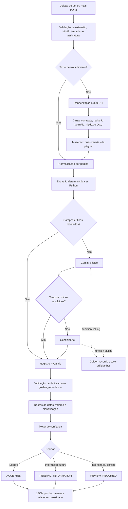
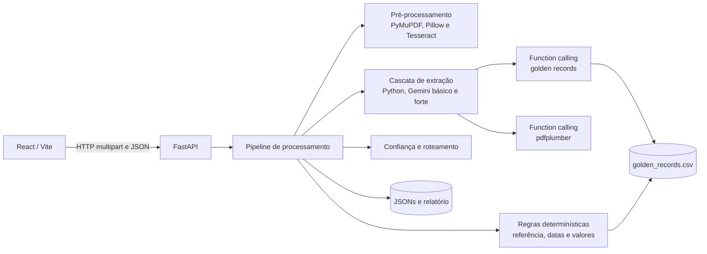

# FinTrace

FinTrace é uma plataforma de processamento de eventos corporativos apoiada por
automação determinística e IA, projetada para transformar avisos financeiros
heterogêneos em registros
estruturados, validados e auditáveis.

A plataforma processa PDFs nativos e escaneados, tenta interpretar o evento
primeiro com Python e escala para LLMs somente quando necessário. Em seguida,
valida o resultado com regras determinísticas e encaminha incertezas materiais
para um operador humano. Cada campo relevante preserva
valor, status, origem, confiança, evidência e resultados de validação.

> IA onde interpretação é necessária. Código onde determinismo é possível.

## Problema resolvido

Avisos de eventos corporativos utilizam layouts e terminologias variadas. O
título pode até contradizer a substância econômica descrita no corpo do
documento. Uma extração incorreta pode alterar o tratamento tributário, o
cronograma de pagamentos e operações posteriores de custódia.

Por isso, o FinTrace não trata a resposta da LLM como verdade. A plataforma
separa:

- Interpretação da linguagem não estruturada;
- Validação determinística de identidade, datas, valores e tipo de evento;
- Dados de referência conhecidos;
- Cálculo de confiança e revisão humana baseada em risco.

O sistema prefere `UNKNOWN` a um valor inventado e diferencia uma extração
incerta de uma informação explicitamente marcada como ainda não divulgada.

## Fluxo de processamento



A LLM participa somente da interpretação. Validações financeiras, temporais,
de identidade, confiança e roteamento permanecem determinísticas, para que uma
resposta probabilística nunca tenha autoridade final sobre o registro.

## Tecnologias e justificativas

- **React + Vite:** mantém a interface operacional pequena e rápida.
- **FastAPI:** fornece upload multipart tipado e documentação OpenAPI.
- **Pydantic v2:** é a fonte de verdade dos contratos estruturados.
- **PyMuPDF:** extrai texto nativo antes de qualquer tentativa de OCR.
- **Tesseract + Pillow:** processam localmente e de forma seletiva páginas
  compostas por imagens, com escala de cinza, autocontraste, redução de ruído,
  nitidez e binarização antes do reconhecimento.
- **Gemini:** é o provider inicial porque sua camada gratuita oferece saída
  estruturada. O `gemini-3.5-flash-lite` atua como modelo básico e o
  `gemini-3.8-flash` como modelo forte. A integração fica atrás de um protocolo
  pequeno e pode ser substituída sem alterar as regras determinísticas.
- **`Decimal` do Python:** evita erros de ponto flutuante binário em cálculos
  financeiros.
- **CSV + filesystem:** são suficientes para o volume atual e mantêm o sistema
  fácil de inspecionar.

A camada gratuita do Gemini pode utilizar o conteúdo enviado para aprimorar produtos
do Google. Ele é adequado ao conjunto de dados sintético fornecido; os termos do
provider e a governança de dados devem ser reavaliados antes do processamento de
documentos confidenciais em produção.

## Arquitetura e separação de responsabilidades



Essa estrutura foi escolhida para manter limites claros:

- O frontend apresenta upload, andamento, evidências e exceções; ele não contém
  regra financeira nem decide confiança;
- A API valida a fronteira HTTP e delega o trabalho ao pipeline;
- O pipeline define a ordem das etapas e impede que o provider controle o fluxo;
- `documents` trata somente leitura, melhoria de imagem e OCR;
- `agent` interpreta o conteúdo e expõe integrações controladas ao provider;
- `tools`, `confidence` e `routing` concentram decisões determinísticas de
  validação, confiança e encaminhamento que podem ser testadas isoladamente;
- Os modelos Pydantic formam o contrato único usado pela API, persistência e
  frontend;
- Dados de entrada, referência e saída ficam separados para evitar que o golden
  record seja confundido com um documento submetido.

Para o escopo do case, essa divisão oferece auditabilidade sem introduzir
camadas operacionais que ainda não agregariam valor, como filas, bancos ou
orquestração distribuída.

## Estrutura do repositório

```text
fintrace/
├── a_data/
│   ├── a_input/                  # PDFs fornecidos e documentos enviados
│   ├── b_output/                 # JSONs e relatório de exceções
│   └── c_golden_records/
│       └── golden_records.csv
├── b_frontend/                   # Interface React organizada por componentes
├── c_backend/
│   ├── src/
│   │   ├── agent/                # Adaptador do provider e mapeamento da extração
│   │   ├── api/                  # Segurança de upload e contratos HTTP
│   │   ├── confidence/           # Motor determinístico de confiança
│   │   ├── documents/            # Extração nativa e OCR
│   │   ├── models/               # Contratos de domínio em Pydantic
│   │   ├── pipeline/             # Orquestração e persistência
│   │   ├── routing/              # Revisão e relatório de exceções
│   │   └── tools/                # Regras de referência, datas, valores e eventos
│   └── tests/
├── d_skills/corporate_actions/   # Conhecimento procedural de Asset Servicing
├── .skills/b_backend_skills/     # Skill complementar de extração de PDFs
├── e_scripts/                    # Scripts do ciclo de vida Docker
├── f_docs/b_architecture/        # Contratos e decisões arquiteturais
└── docker-compose.yml
```

## Configuração

Copie o arquivo de exemplo. Adicione uma chave da API Gemini caso queira habilitar
os níveis de fallback com IA:

```bash
cp .env.example .env
```

Configuração dos modelos:

```dotenv
LLM_PROVIDER=gemini
LLM_BASIC_MODEL=gemini-3.5-flash-lite
LLM_STRONG_MODEL=gemini-3.8-flash
ENABLE_BASIC_LLM_FALLBACK=true
ENABLE_STRONG_LLM_FALLBACK=true
GEMINI_API_KEY=sua-chave
```

Variáveis opcionais importantes:

| Variável | Padrão | Finalidade |
|---|---:|---|
| `MAX_UPLOAD_SIZE_MB` | `20` | Tamanho máximo de cada PDF |
| `OCR_LANGUAGE` | `por` | Idioma utilizado pelo Tesseract |
| `OCR_DPI` | `300` | Resolução usada para renderizar páginas antes do OCR |
| `NATIVE_TEXT_MIN_CHARS` | `80` | Limiar por página antes de acionar OCR |
| `LLM_BASIC_MODEL` | `gemini-3.5-flash-lite` | Modelo de primeira escalada |
| `LLM_STRONG_MODEL` | `gemini-3.8-flash` | Modelo usado na última tentativa |
| `ENABLE_BASIC_LLM_FALLBACK` | `true` | Habilita a primeira escalada com IA |
| `ENABLE_STRONG_LLM_FALLBACK` | `true` | Habilita a última escalada com IA |
| `BACKEND_PORT` | `8000` | Porta da API no host |
| `FRONTEND_PORT` | `5173` | Porta da interface no host |
| `LOG_LEVEL` | `INFO` | Nível dos logs estruturados do backend |

Não faça commit do `.env`; ele está ignorado pelo Git.

Sem uma chave do Gemini, a extração Python continua disponível. Documentos que
não puderem ser resolvidos localmente são encaminhados para revisão humana.

## Estratégia de extração em cascata

O FinTrace evita chamar uma LLM quando os padrões explícitos do documento são
suficientes. A ordem de execução é:

1. O extrator Python procura identificadores, eventos, datas, valores, impostos,
   moedas e proporções, sempre preservando página e trecho de evidência;
2. Um avaliador verifica os campos críticos esperados para o tipo do evento,
   incluindo a data de aprovação;
3. Se houver lacunas ou ambiguidades, o modelo básico interpreta o documento;
4. Se o resultado continuar insuficiente, o modelo forte recebe o documento,
   as pendências e o resultado parcial das tentativas anteriores;
5. O resultado consolidado passa pelas regras determinísticas e, se ainda não
   for seguro, segue para revisão humana.

Uma tentativa posterior não sobrescreve silenciosamente uma informação
divergente. A divergência é preservada como `CONFLICT`. Conflitos objetivos de
identidade, datas ou cálculos não são resolvidos por insistência na LLM.

Cada JSON registra `extraction_attempts`, informando estratégia, modelo,
resultado, campos pendentes e eventual erro do provider.

### Preparação local para OCR

Quando uma página não possui texto nativo suficiente, ela é renderizada a 300
DPI. O backend gera duas versões para o Tesseract:

- Escala de cinza com autocontraste, filtro de mediana e nitidez;
- Versão binária com limiar calculado pelo método de Otsu.

O texto das duas tentativas é pontuado pela quantidade de caracteres e palavras
úteis, e a melhor resposta segue para a extração Python. Dessa forma, a LLM só é
acionada depois que as alternativas locais de leitura e extração foram
esgotadas.

### Tool de validação da referência

Quando uma LLM é acionada, o SDK disponibiliza a função
`lookup_golden_record`. O modelo pode consultar emissor, CNPJ, ISIN, ticker e
classe diretamente na base canônica. O retorno contém correspondências,
conflitos e possíveis registros.

A consulta feita pelo agente não substitui a validação do pipeline: o backend
repete o cruzamento depois da extração e permanece como autoridade final. Dados
da referência nunca são apresentados como evidência extraída do documento.

### Tools de leitura com pdfplumber

Quando o texto normalizado não preserva suficientemente uma tabela ou relação
de layout, a LLM pode chamar três funções controladas pelo backend:

- `extract_pdf_text`: recupera texto de um intervalo de páginas, com opção de
  preservar o layout;
- `extract_pdf_tables`: extrai as tabelas de uma página;
- `inspect_pdf_words`: retorna palavras e suas caixas delimitadoras.

As funções ficam vinculadas ao PDF que está sendo processado. O agente informa
somente páginas e opções de extração; ele não fornece caminhos e não recebe
acesso genérico ao filesystem, execução de código ou MCP. Os retornos também
possuem limites de tamanho para evitar contexto excessivo.

### Skills carregadas pelo agente

Quando a cascata aciona uma LLM, o backend monta a instrução de sistema com:

- A skill de eventos corporativos em `d_skills/corporate_actions`;
- A skill complementar de extração de PDFs em
  `.skills/b_backend_skills/.agents/skills/pdf-extraction`.

O conteúdo de ambas é carregado integralmente na criação do pipeline. A skill
de PDF orienta a interpretação das function callings de texto, tabelas e
layouts; a leitura nativa, a melhoria de imagem e o OCR continuam sendo
executados deterministicamente pelo backend antes da chamada ao agente.

## Execução com Docker

Construa e inicie os dois serviços:

```bash
./e_scripts/start.sh
```

Endereços disponíveis:

- Interface operacional: <http://localhost:5173>
- Documentação da API: <http://localhost:8000/docs>
- Health check: <http://localhost:8000/api/health>

Pare os containers sem removê-los:

```bash
./e_scripts/stop.sh
```

Remova containers e a rede da aplicação:

```bash
./e_scripts/remove.sh
```

Esses scripts nunca apagam `a_data/a_input`, `a_data/b_output` ou os golden
records. Os diretórios de dados são montados diretamente a partir do host.

O script valida o Docker, constrói os dois serviços, aguarda o backend ficar
saudável e só termina quando o frontend também está em execução. O comando
Docker equivalente é:

```bash
docker compose up --build --detach --wait backend frontend
```

## Desenvolvimento local

Backend:

```bash
cd c_backend
python3 -m venv .venv
source .venv/bin/activate
pip install -r requirements.txt
uvicorn src.main:app --reload
```

O Tesseract e o pacote do idioma português precisam estar instalados no host
para processar PDFs escaneados fora do Docker.

Frontend:

```bash
cd b_frontend
npm install
npm run dev
```

Durante o desenvolvimento local, o Vite encaminha `/api` para
`http://localhost:8000`.

## Processamento de documentos

A interface aceita um ou vários PDFs. O endpoint da API é:

```text
POST /api/documents/upload
Content-Type: multipart/form-data
Nome do campo: files
```

Exemplo:

```bash
curl -X POST http://localhost:8000/api/documents/upload \
  -F 'files=@a_data/a_input/02_banco_meridional_jcp.pdf'
```

O documento original de um registro processado pode ser consultado pelo seu
identificador de conteúdo:

```text
GET /api/documents/{document_id}/file
```

O endpoint valida o formato `sha256:<hash>` e localiza o PDF pelo conteúdo. Ele
não aceita caminho de arquivo informado pelo cliente. A interface usa essa rota
para exibir o documento sob demanda dentro do detalhe do registro. A resposta é
servida como `application/pdf`, com disposição `inline` e sem cache no navegador.
Identificadores inválidos, arquivos removidos ou hashes desconhecidos retornam
`404`.

### Uso do painel de resultados

Depois do processamento, a interface organiza o lote em uma sequência de
conferência:

1. A faixa superior resume aceites, revisões, acompanhamentos e falhas;
2. A fila de atenção leva diretamente aos documentos que exigem uma ação;
3. A navegação lateral seleciona o registro que será auditado;
4. O painel de decisão explica o resultado e a próxima ação esperada;
5. A aba `Visão geral` resume os controles e a conferência com a base oficial;
6. A aba `Dados extraídos` explica cada campo e permite abrir sua evidência;
7. A aba `Histórico da análise` reúne tentativas automáticas e regras aplicadas;
8. O operador pode abrir o PDF no próprio detalhe e baixar o JSON individual;
9. O relatório consolidado pode ser baixado pela ação `Baixar relatório do lote`.

O visualizador é carregado somente quando solicitado. A trilha estruturada
continua sendo a fonte principal de auditoria, para que a conferência normal não
dependa da releitura integral do aviso.

Para processar todos os PDFs já presentes em `a_data/a_input` pelo ambiente do
backend:

```bash
cd c_backend
source .venv/bin/activate
python -m src.cli
```

Para reproduzir exatamente o lote entregue usando o Tesseract e as dependências
do container:

```bash
docker compose run --rm --no-deps backend python -m src.cli
```

Documentos específicos podem ser informados como argumentos posicionais.

## Entradas e saídas

Os uploads são sanitizados e validados por extensão, MIME type, tamanho e
assinatura do PDF antes de serem persistidos em `a_data/a_input`. Em caso de
colisão, o novo arquivo recebe um sufixo único; exemplos existentes nunca são
sobrescritos.

`a_data/a_input` é um diretório operacional e está ignorado pelo Git para evitar
versionamento acidental de documentos potencialmente confidenciais. PDFs
recebidos fora da interface devem ser copiados para esse diretório antes da
execução da CLI. Os JSONs entregáveis em `a_data/b_output`, por outro lado, são
versionados.

Cada documento processado produz:

```text
a_data/a_input/exemplo.pdf
→ a_data/b_output/exemplo.json
```

Cada lote também atualiza:

```text
a_data/b_output/exception_report.json
```

O JSON gerado utiliza o schema `1.0`. Valores decimais são representados como
strings e datas seguem ISO 8601. Consulte o
[contrato de saída](f_docs/b_architecture/output-contract.md) completo.

### Resultado gerado para o lote fornecido

Os artefatos entregues estão em `a_data/b_output`. O lote foi executado no
ambiente Docker, com OCR em português disponível, e produziu:

| Documento | Resultado | Motivo quando não aceito automaticamente |
|---|---|---|
| `01_energetica_vale_tiete_dividendo.pdf` | `ACCEPTED` | — |
| `02_banco_meridional_jcp.pdf` | `ACCEPTED` | — |
| `03_siderurgica_paranaense_proventos.pdf` | `ACCEPTED` | — |
| `04_rede_varejo_jcp_sem_data.pdf` | `PENDING_INFORMATION` | Pagamento ainda não divulgado pelo emissor |
| `05_aurora_saneamento_dividendo_datas.pdf` | `REVIEW_REQUIRED` | Pagamento anterior à data-base |
| `06_petroquimica_litoral_grupamento.pdf` | `ACCEPTED` | — |
| `07_telecom_norte_jcp_SCAN.pdf` | `ACCEPTED` | Extraído por OCR |
| `08_construtora_horizonte_bonificacao.pdf` | `REVIEW_REQUIRED` | Ativo não confirmado na base de referência |

Resumo: **8 processados, 5 aceitos, 2 para revisão humana, 1 pendência de
negócio e 0 falhas técnicas**. Todos foram resolvidos pela camada Python; por
isso, o lote não consumiu chamadas de LLM. Isso é comportamento esperado da
cascata, não ausência da integração com IA.

## Confiança e status dos campos

A confiança é categórica, evitando percentuais de precisão inexistente:

- `HIGH`: evidência nativa explícita, enriquecimento por referência exata ou
  derivação determinística validada;
- `MEDIUM`: evidência obtida por OCR ou referência sem correspondência exata
  completa;
- `LOW`: ambiguidade, conflito, conteúdo ilegível, falta de evidência ou falha
  em uma validação do campo.

O status explica o que aconteceu com o campo independentemente da confiança.
Alguns exemplos são `EXTRACTED`, `REFERENCE_ENRICHED`, `DERIVED`,
`NOT_DISCLOSED`, `AMBIGUOUS`, `CONFLICT` e `UNREADABLE`.

Um campo pode corretamente apresentar `value: null`,
`status: NOT_DISCLOSED` e `confidence: HIGH`: o sistema possui alta confiança de
que o emissor ainda não divulgou a informação.

## Revisão humana e exceções

O roteamento é baseado em regras e risco. Alguns gatilhos materiais são:

- Tipo de evento desconhecido ou contraditório;
- Identificadores conflitantes com os golden records;
- Falha em regras temporais ou financeiras;
- Campo crítico ilegível ou com baixa confiança;
- Ativo que não pôde ser confirmado na base de referência.

Informações explicitamente pendentes são direcionadas para acompanhamento, em
vez de serem classificadas como falha de extração. As exceções são classificadas
como negócio, validação, revisão ou erro técnico.

## Auditabilidade

Cada campo material contém:

- Valor e status explícito;
- Origem no documento, referência, derivação ou origem desconhecida;
- Nível de confiança;
- Página e trecho da evidência;
- Método de extração (`NATIVE_TEXT` ou `OCR`);
- Resultados das validações determinísticas.

Na mesa de controle do frontend, essas informações aparecem por campo, junto da
justificativa da confiança. O operador também vê a decisão operacional e seus
motivos, o registro canônico usado na validação, conflitos com valores esperado
e observado, tentativas de extração e evidências da classificação do evento.
Cada registro permite baixar seu JSON e consultar o PDF original; o lote permite
baixar e navegar pelo relatório curto de exceções. Assim, o dado pode ser
auditado diretamente pela trilha estruturada, mantendo o documento disponível
como apoio sem torná-lo necessário para cada conferência.

O backend confirma se a evidência fornecida pela LLM realmente aparece na
página normalizada citada. Trechos não suportados são descartados e o campo é
marcado como ambíguo, em vez de ser aceito silenciosamente.

## Testes

Execute os testes do backend:

```bash
cd c_backend
source .venv/bin/activate
python -m pytest
```

Os testes de documento, OCR, tools de PDF e pipeline usam os PDFs sintéticos do
case em `a_data/a_input`. Como esse diretório é ignorado pelo Git, restaure essas
fixtures antes de executar a suíte completa. Sem elas, é possível validar a
fronteira HTTP e o endpoint do visualizador separadamente:

```bash
python -m pytest tests/test_api.py
```

Gere o build do frontend:

```bash
cd b_frontend
npm run build
```

A suíte não depende de chamadas reais à LLM. O agente pode ser substituído por
um mock, e as regras determinísticas são testadas isoladamente.

## Trade-offs deliberados

- **Sem arquitetura multiagente autônoma:** a cascata possui etapas fixas e
  auditáveis. Os modelos podem escolher entre as function callings explicitamente
  fornecidas para o documento atual, mas não criam agentes, delegam tarefas nem
  alteram a ordem do pipeline. Isso reduz comportamento emergente e facilita a
  reprodução de uma decisão.
- **Function calling com escopo restrito:** o agente acessa golden records e o
  PDF somente por funções vinculadas pelo backend. Não recebe caminho arbitrário,
  shell, filesystem genérico ou MCP. A limitação reduz flexibilidade, mas também
  reduz superfície de ataque e uso de evidência fora do documento atual.
- **Sem vector database:** cada aviso é processado individualmente; não há um
  grande corpus que exija recuperação semântica.
- **Sem banco relacional:** persistência em filesystem é suficiente para o fluxo
  atual, local e de um único operador.
- **Sem fila de tarefas:** o processamento é síncrono no MVP. Uma fila passa a
  ser justificável com usuários concorrentes, jobs longos, retries ou necessidade
  de retomada.
- **Sem LangChain:** o SDK do provider e a orquestração explícita em Python
  mantêm o fluxo de controle visível.
- **Sem percentuais artificiais de confiança:** são usados níveis categóricos
  `HIGH`, `MEDIUM` e `LOW`, derivados de origem, método de extração, status e
  validações. Não existe conjunto calibrado que sustente uma probabilidade
  numérica confiável.
- **Sem retentativa automática ilimitada de LLM:** há no máximo uma chamada ao
  modelo básico e uma ao forte. Repetir indefinidamente elevaria custo e poderia
  mascarar ambiguidade real em vez de encaminhá-la para uma pessoa.
- **Sem confirmação de identidade por fuzzy matching:** similaridade textual
  pode sugerir um registro, mas somente identificadores financeiros o confirmam.
- **Checksum de CNPJ não bloqueante:** a base de referência é sintética e a
  maioria dos CNPJs fornecidos não possui dígitos verificadores válidos.
- **Sem autenticação e isolamento multiusuário:** o case é executado localmente.
  Expor o serviço externamente exigiria autenticação, autorização, criptografia,
  retenção e segregação de documentos.

## Possíveis evoluções

- Avaliar novos providers e calibrar a cascata com métricas reais de qualidade,
  custo e latência;
- Adicionar fila assíncrona e histórico persistente de processamento;
- Implementar autenticação, autorização e isolamento por cliente;
- Capturar correções do operador como feedback auditável;
- Construir datasets de regressão e painéis de qualidade da extração;
- Adotar object storage criptografado e políticas de retenção para produção;
- Ampliar a taxonomia de eventos e os pacotes de regras por mercado.

As justificativas arquiteturais estão registradas nas
[decisões arquiteturais](f_docs/b_architecture/architecture-decisions.md), e a direção
da interface está documentada em
[design do frontend](f_docs/b_architecture/frontend-design.md).
