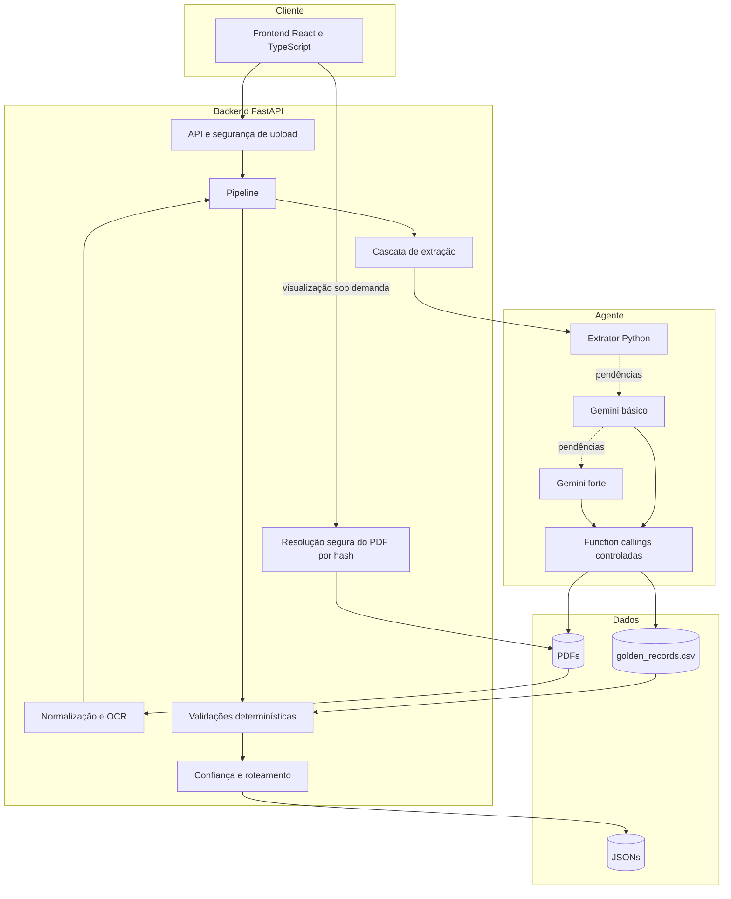

# FinTrace — Decisões arquiteturais

Este documento registra a arquitetura implementada e as fronteiras que devem
ser preservadas em futuras evoluções.

## Visão de componentes

## Estrutura de diretórios

- O frontend está em `b_frontend/`.
- O backend está em `c_backend/`.
- A skill de domínio fica em `d_skills/corporate_actions/`.
- Scripts operacionais ficam em `e_scripts/`.
- `d_infra/` não faz parte do MVP. O `docker-compose.yml` fica na raiz e os
  Dockerfiles ficam junto das respectivas aplicações.
- Os documentos de entrada permanecem em `a_data/a_input/`.
- As saídas são gravadas em `a_data/b_output/`.
- A referência permanece em
  `a_data/c_golden_records/golden_records.csv`. Ela nunca deve ser tratada como
  documento submetido pelo usuário.

## Limites arquiteturais

- A extração segue uma cascata fixa: Python, LLM básica e LLM forte. Cada
  etapa só é acionada se a anterior deixar campos críticos pendentes.
- Regras matemáticas, temporais, de referência, confiança e roteamento são
  executadas em Python.
- A integração com a LLM usa uma interface pequena e mockável, sem LangChain.
- A instrução de sistema combina a skill de eventos corporativos com a skill
  complementar `.skills/b_backend_skills/.agents/skills/pdf-extraction`. Esta
  orienta a interpretação de estrutura e tabelas, mas não substitui o
  pré-processamento determinístico do backend.
- Ao acionar uma LLM, o SDK expõe `lookup_golden_record` como function calling.
  O agente usa a consulta para detectar divergências, enquanto o pipeline repete
  a validação deterministicamente e permanece como autoridade final.
- O SDK também expõe `extract_pdf_text`, `extract_pdf_tables` e
  `inspect_pdf_words`. Essas funções são closures vinculadas ao PDF atual: o
  modelo pode escolher a operação e a página, mas não um caminho de arquivo.
- O agente não possui shell, acesso genérico ao filesystem nem MCP. Function
  calling é usado como uma fronteira explícita de capacidade, não como acesso
  irrestrito ao ambiente.
- O provider inicial é Gemini, usando `gemini-3.5-flash-lite` no nível básico e
  `gemini-3.8-flash` no nível forte. A escolha aproveita a camada gratuita e a
  saída estruturada, mas não altera o núcleo determinístico.
- O MVP persiste PDFs e JSONs no sistema de arquivos. Não há banco de
  dados, fila, banco vetorial ou arquitetura multiagente autônoma.
- O endpoint de processamento é síncrono. Uma fila só será
  introduzida mediante requisito de volume, latência ou recuperação de jobs.
- O endpoint `GET /api/documents/{document_id}/file` resolve o PDF pelo SHA-256
  presente no `document_id`. Nomes e caminhos enviados pelo cliente não são
  usados para localizar arquivos. A busca é restrita a PDFs do diretório de
  entrada, e a resposta é `inline`, privada e sem cache.
- O frontend carrega uma miniatura da primeira página do documento selecionado.
  O visualizador completo depende de ação do operador. A auditoria primária
  permanece no JSON estruturado; o documento é apoio para investigação, não
  uma dependência para conferir cada campo.

## Dependências e representação de dados

- Pydantic é a fonte de verdade do contrato de saída.
- Valores monetários, taxas e proporções usam `Decimal`; JSON os representa
  como strings para evitar perda de precisão.
- Datas usam ISO 8601 (`YYYY-MM-DD`). Datas ausentes permanecem `null`.
- O golden record é lido com a biblioteca padrão `csv`.
- Fuzzy matching sugere candidatos, mas nunca confirma identidade.
- CNPJ é normalizado para dígitos e cruzado com a referência. Checksum não é
  bloqueante no lote sintético, pois a maioria dos identificadores
  fornecidos não possui dígitos verificadores válidos.
- Sugestões por similaridade textual usam `difflib`, da biblioteca padrão.
  RapidFuzz só será introduzido se medições mostrarem ganho
  relevante; similaridade permanece incapaz de confirmar identidade.
- Extração nativa é tentada antes de OCR. Tesseract é acionado somente para
  páginas com texto insuficiente. Antes do reconhecimento, a página é
  renderizada a 300 DPI e passa por escala de cinza, autocontraste, redução de
  ruído, nitidez e binarização por Otsu. A melhor de duas leituras é escolhida
  por uma pontuação determinística de qualidade textual.
- O limiar inicial para OCR é 80 caracteres úteis por página e permanece
  configurável por ambiente.
- A data de aprovação é crítica para os eventos atualmente suportados. Datas
  rotuladas e datas narrativas de reunião ou assembleia são extraídas em Python;
  a ausência desse campo aciona o próximo nível da cascata.
- A tolerância inicial para bruto/líquido/tributo é `0.0000005`, usando Decimal.

## Contratos normativos

- O formato de saída está definido em [output-contract.md](output-contract.md).
- Os códigos são identificadores públicos e estáveis. Mensagens podem evoluir;
  códigos só devem ser removidos em uma nova versão do schema.
- `NOT_DISCLOSED` descreve conhecimento confiável de que o emissor ainda não
  divulgou o dado. Não equivale a falha de extração.
- Informação pendente e revisão humana são rotas distintas.

## Por que esta estrutura foi escolhida

- **API separada do pipeline:** transporte HTTP, validação de upload e CORS não
  contaminam as regras de domínio.
- **Pré-processamento separado da interpretação:** OCR pode ser testado e
  ajustado sem modificar prompts ou modelos financeiros.
- **Cascata explícita:** Python, modelo básico e modelo forte têm ordem e
  critérios observáveis; uma LLM não decide quando outra LLM deve ser chamada.
- **Validação posterior à extração:** mesmo quando a LLM consulta a referência,
  o pipeline repete o cruzamento e continua sendo a autoridade final.
- **Modelos Pydantic compartilhados:** API, persistência, validação e frontend
  consomem o mesmo contrato, reduzindo divergência estrutural.
- **Contrato espelhado em TypeScript estrito:** o frontend tipa registros,
  relatórios, enums e respostas HTTP em `types.ts`. Há alguma duplicação em
  relação ao Pydantic, aceita no MVP; `npm run typecheck` detecta divergências
  durante o desenvolvimento.
- **Filesystem no MVP:** permite inspecionar e entregar diretamente os artefatos
  exigidos pelo case sem banco ou infraestrutura adicional.
- **Documento localizado por identidade de conteúdo:** o mesmo SHA-256 usado no
  contrato identifica o PDF no visualizador e evita confiar em caminhos vindos
  do navegador. A busca linear é adequada ao lote pequeno; em produção, seria
  substituída por índice ou object storage sem mudar o contrato público.

## Decisões negativas e trade-offs

- **Não usar arquitetura multiagente autônoma:** ela aumentaria a quantidade de
  estados, prompts e caminhos de falha sem necessidade para um pipeline curto.
  Em troca, a cascata fixa perde flexibilidade dinâmica, mas ganha
  reprodutibilidade.
- **Não usar banco vetorial ou RAG:** o processamento é individual e toda a
  referência necessária cabe em um CSV pequeno. Introduzir recuperação
  semântica aumentaria complexidade e poderia confundir similaridade com
  identidade financeira.
- **Não usar banco relacional:** o case pede artefatos JSON e opera com um lote
  pequeno. O filesystem não oferece concorrência ou histórico transacional, mas
  é suficiente e diretamente auditável neste escopo.
- **Não usar fila assíncrona:** o endpoint permanece síncrono e simples. Isso não
  escala bem para alto volume, mas evita infraestrutura operacional que o case
  não exige.
- **Não usar LangChain:** o SDK do provider e funções Python explícitas tornam o
  fluxo de controle menor, tipado e fácil de depurar durante a sessão técnica.
- **Não dar acesso irrestrito ao PDF:** as tools ficam vinculadas ao documento
  atual. A LLM perde liberdade para navegar no ambiente, mas não consegue ler
  arquivos alheios ao processamento.
- **Não atribuir probabilidade numérica à confiança:** sem dataset rotulado e
  calibração, um valor como “93%” seria enganoso. Os níveis categóricos são
  explicados por status, origem, evidência, método e validações.
- **Não validar checksum de CNPJ como bloqueio:** os dados são sintéticos e os
  dígitos verificadores não representam identificadores reais. O valor é
  normalizado e comparado com a base fornecida.
- **Não incluir autenticação no MVP:** o ambiente é local. Uma publicação real
  exigiria autenticação, autorização, criptografia e política de retenção.
- **Não embutir o PDF no JSON:** isso aumentaria muito o tamanho do artefato e
  misturaria dado estruturado com conteúdo binário. O frontend solicita por
  endpoint separado a miniatura do documento selecionado e o visualizador
  completo quando necessário.

## Decisões ainda pendentes

- Política de timeout e retry do provider após medição de falhas reais.
- Recalibração do limiar de OCR e das tolerâncias a partir de um corpus maior.
- Autenticação e autorização, caso o produto deixe de ser exclusivamente local.
