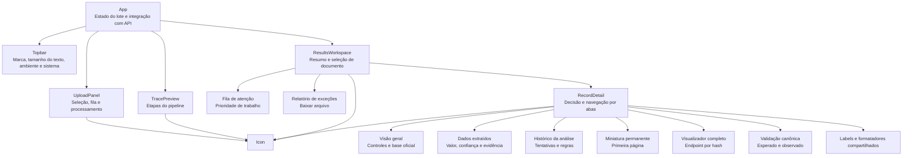

# FinTrace — Direção visual

## Usuário e trabalho principal

A interface atende um operador de serviços de ativos que precisa processar avisos,
detectar exceções e compreender rapidamente por que um registro foi aceito ou
encaminhado. O trabalho principal não é contemplar métricas: é seguir o rastro
entre documento, referência, regras e decisão.

## Tokens

A direção adota azul-marinho e azul institucional, inspirados na linguagem
visual de plataformas bancárias de investimento, sem reproduzir marca, logotipo
ou componentes proprietários do BTG Pactual.

- `background` — `#F2F5F9`: base fria da área operacional.
- `surface` — `#FFFFFF`: área de trabalho e tabelas.
- `ink` — `#10233F`: texto principal em azul-marinho profundo.
- `blue-dark` — `#062B57`: barra superior e resumo do lote.
- `blue` — `#0759AD`: ações primárias e seleção.
- `focus` — `#1683E8`: foco e progresso.
- `warning` — `#A85E00`: acompanhamento e revisão.
- `danger` — `#B42F42`: falha e conflito.
- `success` — `#087B68`: confirmação positiva, reservada a estados.

Tipografia: IBM Plex Sans Variable. A família tem desenho técnico sem transformar
toda informação em monospace. Números usam algarismos tabulares.

## Layout

Alinhamento predominantemente à esquerda. A largura favorece leitura de tabelas
e mantém textos explicativos abaixo de 80 caracteres.

```text
┌───────────────────────────────────────────────────────────┐
│ FinTrace          tamanho do texto + ambiente + sistema │
├──────────────────────┬────────────────────────────────────┤
│ envio dos PDFs       │ ler → confirmar → verificar → agir  │
│ arquivos selecionados│ explicação simples de cada etapa    │
├──────────────────────┴────────────────────────────────────┤
│ resumo do lote + fila de documentos que exigem ação       │
├──────────────────┬────────────────────────────────────────┤
│ documentos       │ decisão + ações do documento           │
│                  │ visão geral | dados | histórico        │
└──────────────────┴────────────────────────────────────────┘
```

## Estrutura de componentes



`App.tsx` concentra apenas estado e orquestração. Componentes visuais não
conhecem regras financeiras: recebem o contrato produzido pelo serviço e o
representam. O contrato é espelhado em `types.ts` e verificado com TypeScript em
modo estrito. Rótulos de domínio ficam em `constants.ts`, enquanto conversões de
apresentação ficam em `utils/formatters.ts`. Essa separação reduz o acoplamento
da tela e permite evoluir detalhes, upload e navegação independentemente.

O PDF é servido por um endpoint que recebe o `document_id` baseado em SHA-256.
O serviço não aceita nomes nem caminhos fornecidos pelo navegador: procura no
diretório de entrada apenas o arquivo cujo conteúdo possui aquele hash. O
detalhe mantém uma miniatura da primeira página e oferece um visualizador
completo por ação do operador. Ambos são conveniências de auditoria; o registro continua
contendo evidência suficiente para análise sem depender da releitura integral.

## Modelo de navegação

A interface segue a ordem real do trabalho:

1. Enviar os documentos;
2. Entender como a análise funciona;
3. Começar pelos documentos que exigem ação;
4. Ler a decisão do documento selecionado;
5. Conferir dados somente quando necessário;
6. Consultar o histórico técnico em uma investigação.

O primeiro documento com exceção é selecionado automaticamente. Dentro do
registro, três abas reduzem a carga cognitiva: `Visão geral`, `Dados extraídos`
e `Histórico da análise`. O painel de decisão fica sempre visível acima delas.

## Cobertura da saída auditável

Para cada documento, o painel de resultados torna visíveis:

- O valor, o status e a origem de cada campo;
- A confiança percentual, a concordância entre agentes e sua justificativa;
- O score agregado de 0 a 100, a completude e os campos materiais ausentes;
- As faixas percentuais e os fatores objetivos, incluindo consenso e efeito do OCR;
- O trecho literal, a página e o método de extração;
- As regras associadas, incluindo valor esperado e observado;
- O registro canônico usado e eventuais conflitos ou possíveis correspondências;
- A decisão operacional e os motivos de revisão ou acompanhamento;
- As tentativas da cascata e os checks preliminares que motivaram a escalada;
- O PDF original, o JSON individual e o relatório curto de exceções.

O relatório de exceções funciona também como navegação: ao selecionar uma
exceção, o operador abre diretamente o registro correspondente.

## Princípios

- A estrutura visual deve representar rastreabilidade, não decoração.
- A decisão e a próxima ação devem ser compreendidas antes dos detalhes técnicos.
- Termos internos são traduzidos para a linguagem do operador.
- Status sempre combina texto, forma e cor.
- Evidência fica próxima do valor que sustenta.
- A base de referência nunca é confundida com evidência documental.
- Azul estrutura navegação e ação; verde fica reservado a confirmação.
- A linha de processamento representa uma sequência real, não uma decoração.
- Estados vazios, carregamento e erro orientam a próxima ação.
- Movimento ocorre apenas em resposta a upload/processamento.

## Autocrítica e revisão

A primeira direção ainda exibia decisão, referência, campos, tentativas e regras
em uma única sequência longa. Mesmo completa, exigia que o operador entendesse
a estrutura técnica do JSON para navegar. A revisão transformou o produto em um
dossiê operacional: a decisão é o elemento memorável, a fila de atenção define
prioridade e as abas separam conferência cotidiana de investigação técnica.

O azul-marinho reforça o contexto bancário sem transformar todos os estados em
azul; revisão, falha e aceite preservam semântica própria. Foram removidos
rótulos decorativos em caixa alta, códigos internos e textos em inglês. O
a miniatura é carregada apenas para o documento selecionado, e o visualizador
completo permanece sob demanda para não competir com a trilha auditável nem
carregar todos os documentos antecipadamente.
