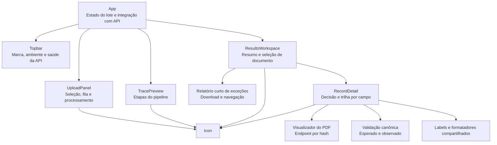

# FinTrace — Direção visual

## Usuário e trabalho principal

A interface atende um operador de Asset Servicing que precisa processar avisos,
detectar exceções e compreender rapidamente por que um registro foi aceito ou
encaminhado. O trabalho principal não é contemplar métricas: é seguir o rastro
entre documento, referência, regras e decisão.

## Tokens

A direção adota azul-marinho e azul institucional, inspirados na linguagem
visual de plataformas bancárias de investimento, sem reproduzir marca, logotipo
ou componentes proprietários do BTG Pactual.

- `paper` — `#EEF2F7`: base fria da área operacional.
- `surface` — `#FFFFFF`: área de trabalho e tabelas.
- `ink` — `#071D3D`: texto principal em azul-marinho profundo.
- `navy` — `#061A38`: barra superior e painéis institucionais.
- `ledger` — `#0057B8`: ações primárias e seleção.
- `signal` — `#1473E6`: foco, informação e progresso.
- `amber` — `#B56A00`: acompanhamento e revisão.
- `danger` — `#BA3344`: falha e conflito.
- `success` — `#007F73`: confirmação positiva, reservada a estados.

Tipografia: IBM Plex Sans Variable. A família tem desenho técnico sem transformar
toda informação em monospace. Números usam algarismos tabulares.

## Layout

Alinhamento predominantemente à esquerda. A largura favorece leitura de tabelas
e mantém textos explicativos abaixo de 80 caracteres.

```text
┌───────────────────────────────────────────────────────────┐
│ FinTrace                         ambiente + saúde da API  │
├──────────────────────┬────────────────────────────────────┤
│ propósito + upload   │ documento → referência → regras    │
│ arquivos selecionados│               → decisão            │
├──────────────────────┴────────────────────────────────────┤
│ resumo + relatório curto de exceções                      │
├──────────────────┬────────────────────────────────────────┤
│ documentos       │ decisão, golden record e PDF           │
│                  │ campos, evidências e validações        │
└──────────────────┴────────────────────────────────────────┘
```

## Estrutura de componentes



`App.jsx` concentra apenas estado e orquestração. Componentes visuais não
conhecem regras financeiras: recebem o contrato produzido pelo backend e o
representam. Labels de domínio ficam em `constants.js`, enquanto conversões de
apresentação ficam em `utils/formatters.js`. Essa separação reduz o acoplamento
da tela e permite evoluir detalhes, upload e navegação independentemente.

O PDF é servido por um endpoint que recebe o `document_id` baseado em SHA-256.
O backend não aceita nomes nem caminhos fornecidos pelo navegador: procura no
diretório de entrada apenas o arquivo cujo conteúdo possui aquele hash. O
visualizador embutido é uma conveniência de auditoria; o registro continua
contendo evidência suficiente para análise sem depender da releitura integral.

## Cobertura da saída auditável

Para cada documento, a mesa de controle torna visíveis:

- O valor, o status e a origem de cada campo;
- A confiança categórica e a justificativa dessa confiança;
- O trecho literal, a página e o método de extração;
- As regras associadas, incluindo valor esperado e observado;
- O registro canônico usado e eventuais conflitos ou possíveis correspondências;
- A decisão operacional e os motivos de revisão ou acompanhamento;
- As tentativas da cascata de extração;
- O PDF original, o JSON individual e o relatório curto de exceções.

O relatório de exceções funciona também como navegação: ao selecionar uma
exceção, o operador abre diretamente o registro correspondente.

## Princípios

- A estrutura visual deve representar rastreabilidade, não decoração.
- Status sempre combina texto, forma e cor.
- Evidência fica próxima do valor que sustenta.
- A base de referência nunca é confundida com evidência documental.
- Azul estrutura navegação e ação; verde fica reservado a confirmação.
- A linha de processamento é o único gesto visual expressivo.
- Empty, loading e erro orientam a próxima ação.
- Movimento ocorre apenas em resposta a upload/processamento.

## Autocrítica e revisão

A primeira direção poderia facilmente virar um dashboard SaaS com quatro cards
de métricas. Ela foi substituída por uma superfície operacional com divisórias,
faixa de resumo e mesa de documentos. A linha de processamento não é uma
timeline decorativa: comunica quatro etapas reais e seus estados. O azul-marinho
reforça o contexto bancário sem transformar todos os estados em azul; revisão,
falha e aceite preservam semântica própria. O visualizador de PDF foi mantido
sob demanda para não competir com a leitura da trilha auditável nem carregar
todos os documentos antecipadamente.
